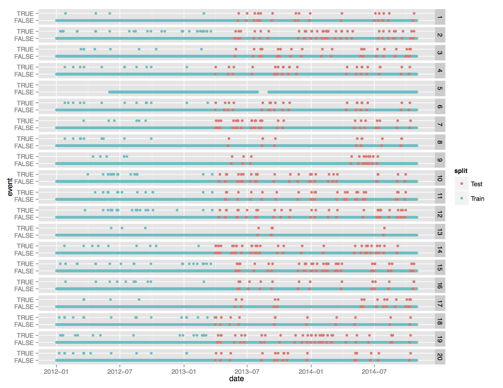

# Walmart Recruiting II: Sales in Stormy Weather

## Description

Walmart operates 11,450 stores in 27 countries, managing inventory across varying climates and cultures. Extreme weather events, like hurricanes, blizzards, and floods, can have a huge impact on sales at the store and product level. 

In their second Kaggle recruiting competition, Walmart challenges participants to accurately predict the sales of 111 potentially weather-sensitive products (like umbrellas, bread, and milk) around the time of major weather events at 45 of their retail locations. 

Intuitively, we may expect an uptick in the sales of umbrellas before a big thunderstorm, but it's difficult for replenishment managers to correctly predict the level of inventory needed to avoid being out-of-stock or overstock during and after that storm. Walmart relies on a variety of vendor tools to predict sales around extreme weather events, but it's an ad-hoc and time-consuming process that lacks a systematic measure of effectiveness. 

Helping Walmart better predict sales of weather-sensitive products will keep valued customers out of the rain. It could also earn you a position at one of the most data-driven retailers in the world! 

## Evaluation
Submissions are evaluated one the Root Mean Squared Logarithmic Error (RMSLE). The RMSLE is calculated as

## Data
You have been provided with sales data for 111 products whose sales may be affected by the weather (such as milk, bread, umbrellas, etc.). These 111 products are sold in stores at 45 different Walmart locations. Some of the products may be a similar item (such as milk) but have a different id in different stores/regions/suppliers. The 45 locations are covered by 20 weather stations (i.e. some of the stores are nearby and share a weather station).

The competition task is to predict the amount of each product sold around the time of major weather events. For the purposes of this competition, we have defined a weather event as any day in which more than an inch of rain or two inches of snow was observed. You are asked to predict the units sold for a window of ±3 days surrounding each storm.

The following graphic shows the layout of the test windows. The green dots are the training set days, the red dots are the test set days, and the event=True are the days with storms. Note that this plot is for the 20 weather stations. All days prior to 2013-04-01 are given out as training data.

[kaggle link]: https://www.kaggle.com/c/walmart-recruiting-sales-in-stormy-weather

You are provided with the full observed weather covering the entire data set. You do not need to forecast weather in addition to sales (it's as though you have a perfect weather forecast at your disposal).

You will not be provided with more information about the products, store locations, or other details.
Because the storms occur at variable times and in variable locations, use the test set file (or sample submission) as your guide to know which days and stores you must forecast.
The sales data does not capture the difference between the stock and the demand. In other words, sales number 0 doesn't necessarily mean there was no demand for this product; it may mean it was in stock but none were sold, or it could mean that the product was out of stock, or discontinued and not available. 

### Train Field descriptions
- date - the day of sales or weather
- store_nbr - an id representing one of the 45 stores
- station_nbr - an id representing one of 20 weather stations
- item_nbr - an id representing one of the 111 products
- units - the quantity sold of an item on a given day
- id - a triplet representing a store_nbr, item_nbr, and date. Form the id by concatenating these (in that order) with an underscore. E.g. "2_1_2013-04-01" represents store 2, item 1, sold on 2013-04-01.

### File descriptions
- key.csv - the relational mapping between stores and the weather stations that cover them
- sampleSubmission.csv - file that gives the prediction format
- train.csv - sales data for all stores & dates in the training set
- test.csv - stores & dates for forecasting (missing 'units', which you must predict) 
- weather.csv - a file containing the NOAA weather information for each station and day
- noaa_weather_qclcd_documentation.pdf - a guide to understand the data provided in the weather.csv file

## Result
- Store별로 모델을 만들어 분석 진행
- 날씨의 영향을 거의 받지 않는다 그러므로 회귀분석은 적용하기 힘들다
- 시계열분석으로 접근해야한다. 
	- Moving Average, Facebook Prophet을 사용해서 분석해보기로 한다
	